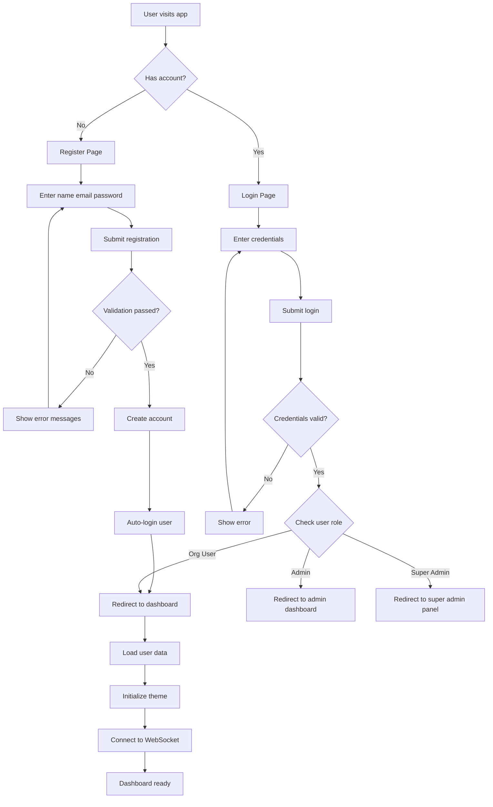
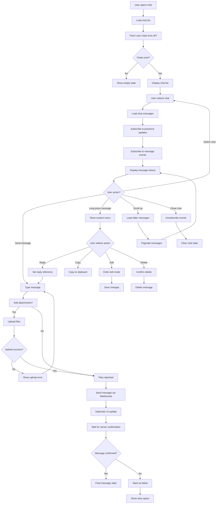
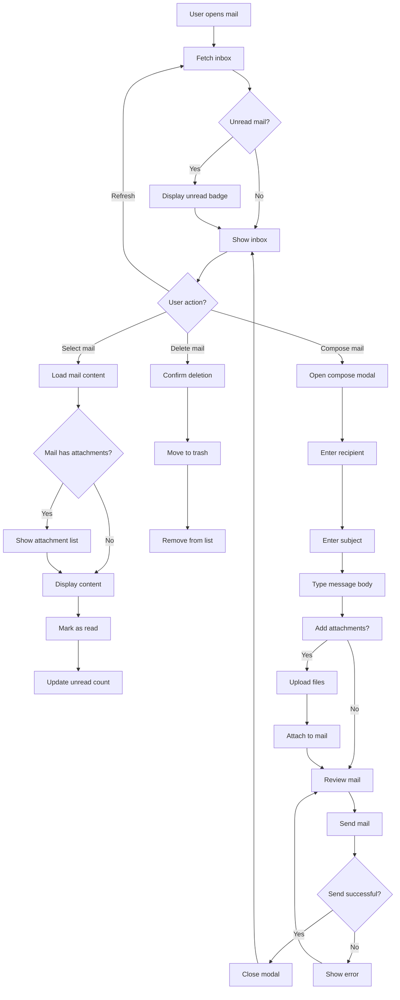
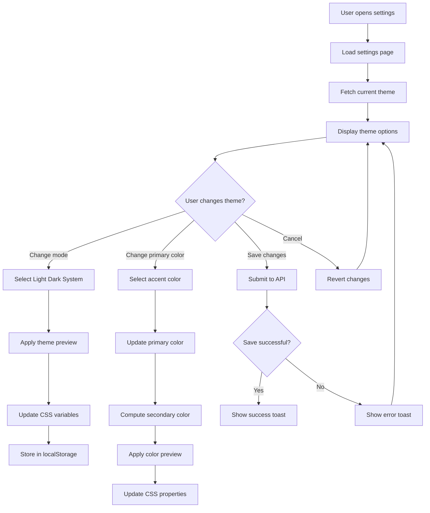
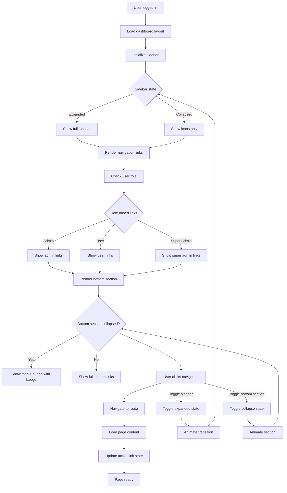
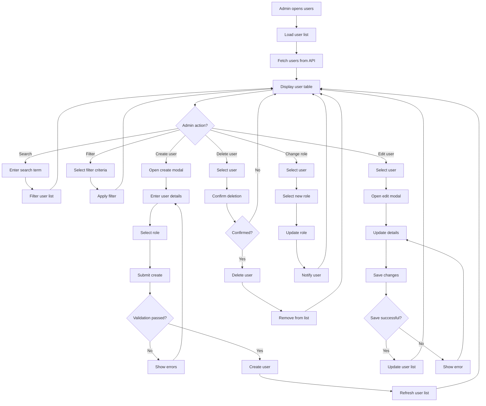
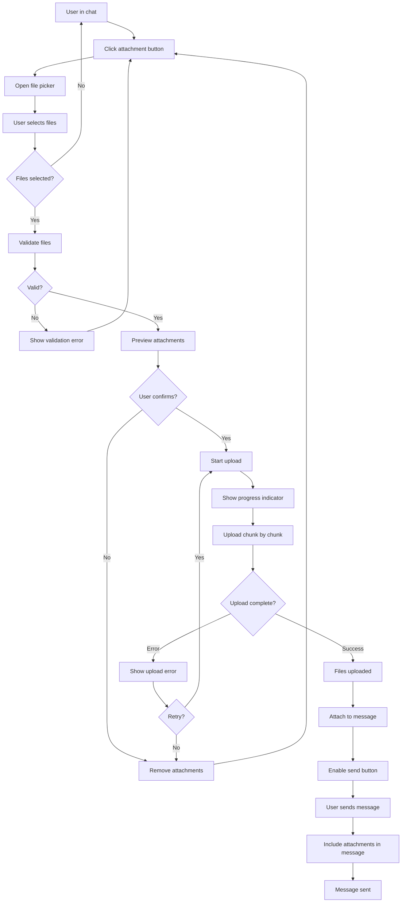
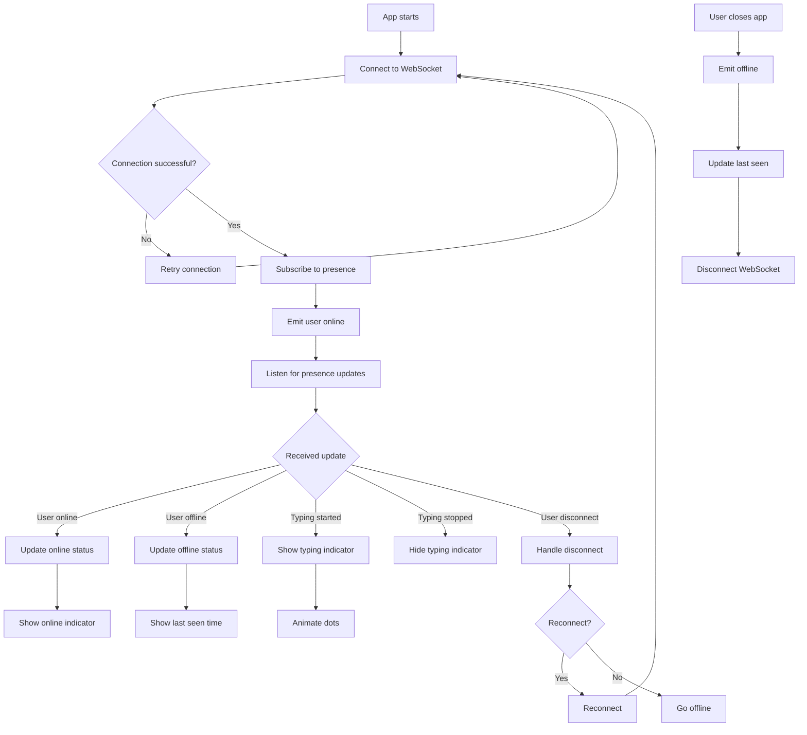
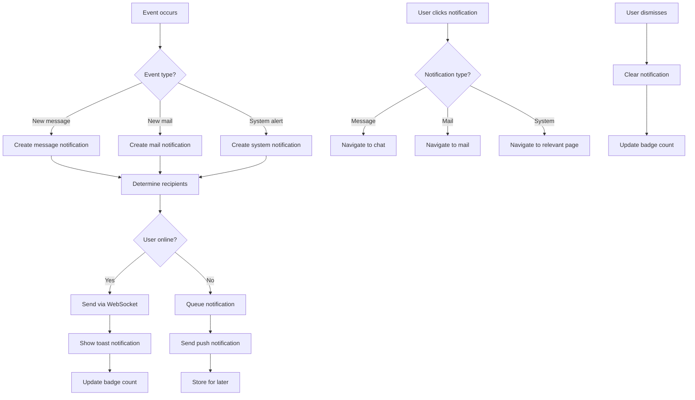
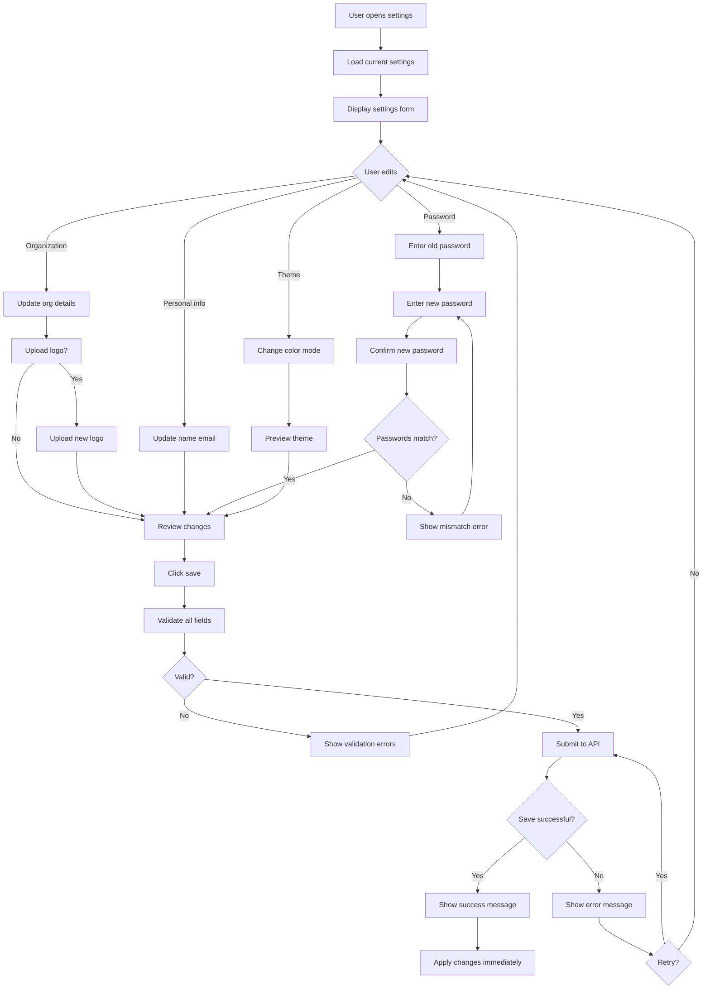

# System Activity Diagrams
## EduVerse - Mermaid Flowcharts

---

## 1. User Authentication Flow

---

## 2. Chat Messaging Flow

---

## 3. Mail System Flow

---

## 4. Theme Settings Flow

---

## 5. Dashboard Navigation Flow

---

## 6. Admin User Management Flow

---

## 7. File Upload Flow (Chat Attachment)

---

## 8. Real-time Presence Flow

---

## 9. Notification System Flow

---

## 10. Settings Update Flow

---

## How to Use These Diagrams

1. **Mermaid Live Editor**: Paste any diagram code into https://mermaid.live
2. **VS Code**: Install "Markdown Preview Mermaid Support" extension
3. **GitHub/GitLab**: Mermaid is natively supported in markdown files
4. **Documentation**: Include in README.md or Wiki pages

---

## Main Activities Summary

| Activity | Description | Key Files |
|----------|-------------|-----------|
| **Authentication** | Login, register, role-based routing | `login/page.tsx`, `register/page.tsx` |
| **Chat Messaging** | Real-time messaging with attachments | `ChatLayout.tsx`, `ChatMessage.tsx` |
| **Mail System** | Inbox, compose, read mail | `mail/page.tsx`, `NewMailModal.tsx` |
| **Theme Settings** | Light/dark mode, color customization | `ThemeContext.tsx`, `settings/page.tsx` |
| **Dashboard Navigation** | Sidebar, layout, responsive behavior | `DashboardLayout.tsx`, `Navbar.tsx` |
| **Admin Management** | User CRUD, role management | Admin page components |
| **File Upload** | Attachment handling in chat/mail | Upload components |
| **Real-time Presence** | Online status, typing indicators | `EventsGateway`, presence subscriptions |
| **Notifications** | Toast messages, badges | Notification components |
| **Settings Management** | User/org settings updates | `settings/page.tsx` |
