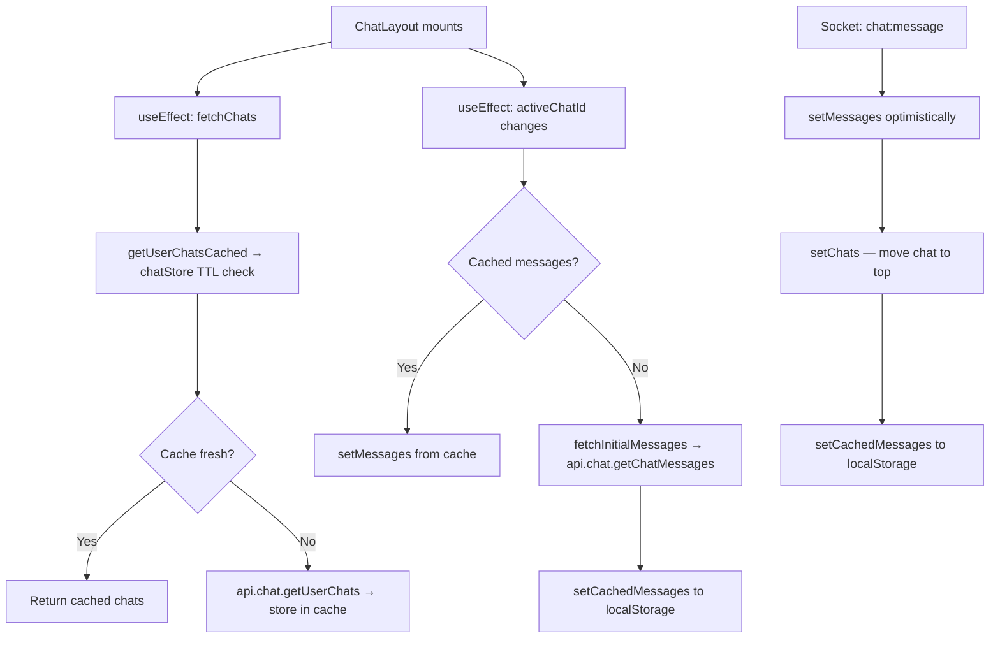

# Chat Module Migration: Custom Store → useSWR

Migrate the chat frontend from a hand-rolled `chatStore.ts` (with manual TTL caching, in-flight deduplication, and `localStorage` persistence) and `useEffect`-based fetching inside `ChatLayout.tsx` to the existing global `useSWR` infrastructure.

---

## Background & Motivation

The current chat module uses a **completely separate data-fetching paradigm** from the rest of the app:

| Concern | Rest of App (already migrated) | Chat Module (current) |
|---------|-------------------------------|----------------------|
| Fetching | `useSWR` with global `SWRProvider` fetcher | Manual `useEffect` → `api.chat.*` |
| Caching | SWR dedup + in-memory cache | Custom `chatStore.ts` with 3s TTL |
| Loading state | `isLoading` from SWR | Manual `useState` booleans |
| Revalidation | `mutate()` | `invalidateChats()` + `fetchChats()` |
| Persistence | None (SWR in-memory) | `localStorage` via `chat_session_store` |

This creates inconsistency, duplicated logic, and makes the chat module harder to maintain.

---

## User Review Required

> [!IMPORTANT]
> **Session persistence trade-off**: The current `chatStore` persists messages and composer state to `localStorage`. SWR is in-memory only. The plan preserves `localStorage` persistence for **composer states only** (drafts, reply-to, editing) via a thin `useComposerPersistence` hook, and drops message caching to `localStorage` (SWR's in-memory cache is sufficient since messages are always fetched fresh on chat switch). **Do you want to keep localStorage message caching?**

> [!WARNING]
> **Socket-driven mutations are the core complexity here.** Chat data is mutated primarily via WebSocket events (`chat:message`, `chat:read`, `chat:message:delete`, `chat:message:edit`, `chat:update`), not REST refetches. The plan uses `useSWRConfig().mutate()` with optimistic updaters inside socket handlers rather than SWR's standard revalidation pattern. This is intentional — a full refetch on every incoming message would be wasteful and cause scroll jank.

---

## Open Questions

> [!IMPORTANT]
> **Messages pagination model**: Messages use cursor-based pagination (`aroundId`) and page-based pagination interchangeably. SWR doesn't natively handle infinite/bidirectional scroll. The plan uses a **single SWR key per active chat** for the initial fetch, with manual `setSize`-style state for earlier/newer pages merged into the SWR cache via `mutate()`. An alternative is `useSWRInfinite`, but it doesn't support bidirectional loading. **Are you okay with this hybrid approach?**

---

## Current Architecture (What Exists)

### Files Involved

| File | Role | Lines |
|------|------|-------|
| [ChatLayout.tsx](file:///c:/Users/Open%20PC/Documents/Zigron/school-management/frontend/components/chat/ChatLayout.tsx) | Monolithic chat UI + all data fetching | ~2172 |
| [chatStore.ts](file:///c:/Users/Open%20PC/Documents/Zigron/school-management/frontend/lib/chatStore.ts) | Manual cache layer for chats, messages, composer | 202 |
| [chatLayoutHelpers.ts](file:///c:/Users/Open%20PC/Documents/Zigron/school-management/frontend/components/chat/chatLayoutHelpers.ts) | Pure helper functions (types, formatters, mergers) | 257 |
| [NewChatModal.tsx](file:///c:/Users/Open%20PC/Documents/Zigron/school-management/frontend/components/chat/NewChatModal.tsx) | Create chat / add participants | 361 |
| [ChatSettingsModal.tsx](file:///c:/Users/Open%20PC/Documents/Zigron/school-management/frontend/components/chat/ChatSettingsModal.tsx) | Group settings, avatar, roles | 278 |
| [SWRProvider.tsx](file:///c:/Users/Open%20PC/Documents/Zigron/school-management/frontend/components/providers/SWRProvider.tsx) | Global SWR config + fetcher dispatch | 212 |
| [AuthContext.tsx](file:///c:/Users/Open%20PC/Documents/Zigron/school-management/frontend/context/AuthContext.tsx) | Imports `clearChatSession` for logout | 215 |

### Current Data Flow (ChatLayout)



### State Variables to Migrate (ChatLayout.tsx lines 71-150)

| State Variable | Current Source | SWR Migration Target |
|---------------|---------------|---------------------|
| `chats` | `useState` + `fetchChats()` | ✅ `useSWR('chat-list')` |
| `messages` | `useState` + `fetchInitialMessages()` | ✅ `useSWR(['chat-messages', chatId])` |
| `isLoadingChats` | `useState(true)` | ✅ `isLoading` from SWR |
| `isLoadingMessages` | `useState(false)` | ✅ `isLoading` from SWR |
| `chatComposerStates` | `useState` + localStorage sync | ⚠️ Keep — not fetched data, UI-only state persisted to localStorage |
| `isSending` | `useState(false)` | ⚠️ Keep — mutation-in-flight flag |
| `isUploading` | `useState(false)` | ⚠️ Keep — mutation-in-flight flag |
| `activeChatId` | `useState` | ⚠️ Keep — UI selection state |
| `searchQuery` | `useState` | ⚠️ Keep — UI filter state |
| `messagesPage` | `useState(1)` | ✅ Remove — tracked inside custom hook |
| `hasMoreMessages` | `useState(true)` | ✅ Remove — tracked inside custom hook |
| `hasMoreAfter` | `useState(false)` | ✅ Remove — tracked inside custom hook |
| `isLoadingMore` | `useState(false)` | ✅ Remove — tracked inside custom hook |
| `isLoadingNewer` | `useState(false)` | ✅ Remove — tracked inside custom hook |
| `isViewingHistory` | `useState(false)` | ✅ Remove — tracked inside custom hook |
| `onlineUsers` | `useState` | ⚠️ Keep — socket-driven, not REST data |
| `typingByChatId` | `useState` | ⚠️ Keep — socket-driven, not REST data |

---

## Proposed Changes

### Phase 1: SWR Infrastructure

---

#### [MODIFY] [SWRProvider.tsx](file:///c:/Users/Open%20PC/Documents/Zigron/school-management/frontend/components/providers/SWRProvider.tsx)

Add chat resource keys to the `FetcherKey` union and fetcher switch:

```typescript
// New keys to add to FetcherKey type:
| readonly ['chat-list']
| readonly ['chat-messages', string, object]   // [chatId, { page?, limit?, aroundId? }]
| readonly ['chat-users']                      // for NewChatModal searchUsers

// New cases in createFetcher switch:
case 'chat-list':
    return await api.chat.getUserChats(token) as T;
case 'chat-messages': {
    const [chatId, params] = args as [string, { page?: number; limit?: number; aroundId?: string }];
    return await api.chat.getChatMessages(chatId, token, params) as T;
}
case 'chat-users':
    return await api.chat.searchUsers(token) as T;
```

---

### Phase 2: Custom Hooks

---

#### [NEW] [useChats.ts](file:///c:/Users/Open%20PC/Documents/Zigron/school-management/frontend/hooks/useChats.ts)

A thin hook wrapping `useSWR` for the chat list, with helpers for socket-driven mutations.

```typescript
import useSWR, { mutate } from 'swr';
import { Chat } from '@/types';
import { useAuth } from '@/context/AuthContext';

const CHAT_LIST_KEY = ['chat-list'] as const;

export function useChats() {
    const { token } = useAuth();

    const { data: chats = [], isLoading, error, mutate: mutateChats } = useSWR<Chat[]>(
        token ? CHAT_LIST_KEY : null,
        {
            revalidateOnFocus: true,
            dedupingInterval: 3000,  // matches old 3s TTL
        }
    );

    return { chats, isLoading, error, mutateChats };
}

// Utility for external callers (NewChatModal, ChatSettingsModal)
export function invalidateChatList() {
    mutate(CHAT_LIST_KEY);
}
```

**Key behaviors preserved:**
- 3s dedup interval mirrors the old `CHAT_CACHE_TTL_MS`
- `mutateChats` replaces both `setChats` and `invalidateChats()`
- Socket handlers will call `mutateChats(updater, { revalidate: false })` for optimistic updates

---

#### [NEW] [useChatMessages.ts](file:///c:/Users/Open%20PC/Documents/Zigron/school-management/frontend/hooks/useChatMessages.ts)

Encapsulates initial message fetch, pagination state, and scroll-to-message logic.

```typescript
import useSWR from 'swr';
import { useState, useCallback, useRef } from 'react';
import { ChatMessage, PaginatedResponse } from '@/types';
import { ChatMessageWithMeta, mergeUniqueMessages } from '@/components/chat/chatLayoutHelpers';
import { useAuth } from '@/context/AuthContext';

export function useChatMessages(chatId: string | null, targetMessageId?: string | null) {
    const { token } = useAuth();
    
    // Build the SWR key for initial fetch
    const messageParams = targetMessageId
        ? { limit: 35, aroundId: targetMessageId }
        : { limit: 35, page: 1 };
    
    const swrKey = chatId && token
        ? ['chat-messages', chatId, messageParams] as const
        : null;

    const { data: initialData, isLoading, mutate: mutateMessages } = useSWR<PaginatedResponse<ChatMessage>>(
        swrKey,
        {
            revalidateOnFocus: false,     // messages are socket-driven
            revalidateOnReconnect: false,
            dedupingInterval: 5000,
        }
    );

    // Local state for merged messages (initial + paginated + socket)
    const [mergedMessages, setMergedMessages] = useState<ChatMessageWithMeta[]>([]);
    const [messagesPage, setMessagesPage] = useState(1);
    const [hasMoreBefore, setHasMoreBefore] = useState(true);
    const [hasMoreAfter, setHasMoreAfter] = useState(false);
    const [isLoadingMore, setIsLoadingMore] = useState(false);
    const [isLoadingNewer, setIsLoadingNewer] = useState(false);
    const [isViewingHistory, setIsViewingHistory] = useState(!!targetMessageId);

    // Sync SWR data → local merged state when initial data arrives
    // (useEffect inside hook, triggered by initialData change)

    // loadEarlierMessages / loadNewerMessages — same logic as current,
    // but updates mergedMessages via setMergedMessages

    return {
        messages: mergedMessages,
        setMessages: setMergedMessages,
        isLoading,
        hasMoreBefore,
        hasMoreAfter,
        isLoadingMore,
        isLoadingNewer,
        isViewingHistory,
        loadEarlierMessages,
        loadNewerMessages,
        mutateMessages,
    };
}
```

> [!NOTE]
> This hook owns all pagination state that was previously scattered across 6+ `useState` calls in ChatLayout (lines 142-150). The hook exposes `setMessages` so socket handlers in ChatLayout can still do optimistic insertions.

---

#### [NEW] [useComposerPersistence.ts](file:///c:/Users/Open%20PC/Documents/Zigron/school-management/frontend/hooks/useComposerPersistence.ts)

Preserves the `localStorage` persistence for composer drafts without the full chatStore:

```typescript
import { useState, useEffect } from 'react';
import { ChatComposerStateMap } from '@/components/chat/chatLayoutHelpers';

const STORAGE_KEY = 'chat_composer_states';

function loadComposerStates(): ChatComposerStateMap {
    if (typeof window === 'undefined') return {};
    try {
        const stored = localStorage.getItem(STORAGE_KEY);
        return stored ? JSON.parse(stored) : {};
    } catch { return {}; }
}

function saveComposerStates(states: ChatComposerStateMap) {
    if (typeof window === 'undefined') return;
    try { localStorage.setItem(STORAGE_KEY, JSON.stringify(states)); } catch {}
}

export function useComposerPersistence() {
    const [composerStates, setComposerStates] = useState<ChatComposerStateMap>(loadComposerStates);

    useEffect(() => {
        saveComposerStates(composerStates);
    }, [composerStates]);

    return [composerStates, setComposerStates] as const;
}
```

---

### Phase 3: ChatLayout Refactor

---

#### [MODIFY] [ChatLayout.tsx](file:///c:/Users/Open%20PC/Documents/Zigron/school-management/frontend/components/chat/ChatLayout.tsx)

This is the largest change. The modifications are grouped by concern:

##### 3a. Replace imports (lines 1-58)

```diff
-import {
-    getUserChatsCached,
-    insertOrUpdateChatFromMessage,
-    markAsReadGuard,
-    getCachedChats,
-    getCachedMessages,
-    setCachedMessages,
-    getCachedComposerStates,
-    setCachedComposerStates
-} from '@/lib/chatStore';
+import { useChats } from '@/hooks/useChats';
+import { useChatMessages } from '@/hooks/useChatMessages';
+import { useComposerPersistence } from '@/hooks/useComposerPersistence';
+import { markAsReadGuard } from '@/lib/chatStore'; // keep only this
```

##### 3b. Replace chat list fetching (lines 71, 88, 309-328)

**Before:**
```typescript
const [chats, setChats] = useState<Chat[]>([]);
const [isLoadingChats, setIsLoadingChats] = useState(true);

const fetchChats = useCallback(async () => { ... }, [token]);
useEffect(() => { fetchChats(); ... }, [token, fetchChats]);
```

**After:**
```typescript
const { chats, isLoading: isLoadingChats, mutateChats } = useChats();
```

- All `setChats(...)` calls in socket handlers become `mutateChats(updater, { revalidate: false })`
- `fetchChats()` calls become `mutateChats()` (triggers revalidation)

##### 3c. Replace message fetching (lines 82-87, 89, 142-150, 330-400, 460-515)

**Before:**
```typescript
const [messages, setMessages] = useState<ChatMessageWithMeta[]>(() => {
    if (initialChatId) return getCachedMessages(initialChatId);
    return [];
});
const [isLoadingMessages, setIsLoadingMessages] = useState(false);
const [messagesPage, setMessagesPage] = useState(1);
const [hasMoreMessages, setHasMoreMessages] = useState(true);
// ... 6 more useState calls

const fetchInitialMessages = useCallback(async (chatId, targetMsgId) => { ... });
useEffect(() => { if (!activeChatId) return; ... fetchInitialMessages(...) }, [...]);

const loadEarlierMessages = async () => { ... };
const loadNewerMessages = async () => { ... };
```

**After:**
```typescript
const {
    messages, setMessages,
    isLoading: isLoadingMessages,
    hasMoreBefore: hasMoreMessages,
    hasMoreAfter,
    isLoadingMore, isLoadingNewer,
    isViewingHistory,
    loadEarlierMessages, loadNewerMessages,
    mutateMessages,
} = useChatMessages(activeChatId, targetMessageId);
```

**~70 lines of state declarations and ~100 lines of fetch logic removed from ChatLayout.**

##### 3d. Replace composer state persistence (lines 91, 391-393)

**Before:**
```typescript
const [chatComposerStates, setChatComposerStates] = useState<ChatComposerStateMap>(() => getCachedComposerStates());

useEffect(() => { setCachedComposerStates(chatComposerStates); }, [chatComposerStates]);
```

**After:**
```typescript
const [chatComposerStates, setChatComposerStates] = useComposerPersistence();
```

##### 3e. Refactor socket handlers to use SWR mutate (lines 518-689)

The socket `chat:message` handler currently calls `setChats(prev => ...)` and `setMessages(prev => ...)`. These become:

```typescript
// chat:message handler
mutateChats(
    (currentChats) => {
        if (!currentChats) return currentChats;
        // Same logic as current setChats updater
        const chatIndex = currentChats.findIndex(c => c.id === message.chatId);
        // ... move chat to top, update unreadCount ...
        return updatedChats;
    },
    { revalidate: false }
);

// Messages still use local setMessages (from useChatMessages hook)
// because they need instant optimistic updates for scroll behavior
setMessages(prev => reconcileIncomingMessage(prev, message, user.id, pendingId));
```

The `chat:read`, `chat:message:delete`, `chat:message:edit`, `chat:update` handlers follow the same pattern.

##### 3f. Remove localStorage message sync (lines 396-400, 611-624)

**Delete entirely:**
```typescript
// This useEffect syncs messages → localStorage on every change
useEffect(() => {
    if (activeChatId && messages.length > 0) {
        setCachedMessages(activeChatId, messages);
    }
}, [messages, activeChatId]);

// Also remove getCachedMessages/setCachedMessages calls in chat:read handler
```

##### 3g. Replace `fetchChats()` call sites

| Location | Current | After |
|----------|---------|-------|
| Line 324 | `fetchChats()` | Automatic via SWR mount |
| Line 1088 | `fetchChats()` (after removeParticipant) | `mutateChats()` |
| Line 1122 | `fetchChats()` (after chat created) | `mutateChats()` |

##### 3h. Replace unread count sync (lines 402-405)

**Before:**
```typescript
useEffect(() => {
    const unread = chats.reduce((total, chat) => total + (chat.unreadCount || 0), 0);
    dispatchRef.current({ type: 'STATS_SET_CHAT', payload: { unread } });
}, [chats]);
```

This stays as-is — `chats` now comes from SWR but the `useEffect` pattern for derived side-effects is still appropriate.

---

### Phase 4: Sibling Component Updates

---

#### [MODIFY] [NewChatModal.tsx](file:///c:/Users/Open%20PC/Documents/Zigron/school-management/frontend/components/chat/NewChatModal.tsx)

```diff
-import { invalidateChats } from '@/lib/chatStore';
+import { invalidateChatList } from '@/hooks/useChats';

// Line 165, 185: Replace invalidateChats() with invalidateChatList()
-invalidateChats();
+invalidateChatList();
```

Optionally, the `contactableUsers` fetch (lines 80-113) can also be migrated to useSWR:

```typescript
const chatUsersKey = isOpen && token ? ['chat-users'] as const : null;
const { data: rawUsers = [], isLoading: isFetchingUsers } = useSWR<User[]>(chatUsersKey);
```

This eliminates the `useEffect` + `useState` pair for user fetching.

---

#### [MODIFY] [ChatSettingsModal.tsx](file:///c:/Users/Open%20PC/Documents/Zigron/school-management/frontend/components/chat/ChatSettingsModal.tsx)

The `onUpdate` callback prop currently triggers `fetchChats()` in the parent. After migration, the parent passes `mutateChats` or a wrapper:

```typescript
// In ChatLayout, where ChatSettingsModal is rendered:
<ChatSettingsModal
    ...
    onUpdate={() => mutateChats()}  // was: fetchChats()
/>
```

No internal changes needed in ChatSettingsModal itself.

---

### Phase 5: Decommission chatStore

---

#### [MODIFY] [chatStore.ts](file:///c:/Users/Open%20PC/Documents/Zigron/school-management/frontend/lib/chatStore.ts)

**Remove everything except:**
- `markAsReadGuard()` — still needed (it's a write operation with dedup logic, not a cache)
- `clearChatSession()` — still needed by `AuthContext` for logout cleanup (now just clears composer localStorage)

**Delete:**
- `ChatCache` type and `cache.chats` object (replaced by SWR)
- `getUserChatsCached()` (replaced by `useChats` hook)
- `invalidateChats()` (replaced by `invalidateChatList()`)
- `insertOrUpdateChatFromMessage()` (replaced by SWR mutate updater)
- `getCachedChats()` (replaced by SWR cache)
- `getCachedMessages()` / `setCachedMessages()` / `updateCachedMessages()` (dropped)
- `getCachedComposerState()` / `setCachedComposerState()` / `getCachedComposerStates()` / `setCachedComposerStates()` (replaced by `useComposerPersistence`)
- `getLastReadMessageId()` / `setLastReadMessageId()` — used only inside `markAsReadGuard`, keep there

**Reduced from 202 lines to ~50 lines.**

---

#### [MODIFY] [AuthContext.tsx](file:///c:/Users/Open%20PC/Documents/Zigron/school-management/frontend/context/AuthContext.tsx)

```diff
-import { clearChatSession } from '@/lib/chatStore';
+import { clearChatSession } from '@/lib/chatStore'; // still exists, now only clears composer storage
```

No change needed if we keep `clearChatSession` in the slimmed chatStore. The function just needs to clear the composer localStorage key now.

---

## Summary of Net Changes

| Metric | Before | After |
|--------|--------|-------|
| ChatLayout `useState` calls for data | ~10 | ~3 (isSending, isUploading, activeChatId) |
| ChatLayout `useEffect` for fetching | 3 | 0 |
| chatStore.ts lines | 202 | ~50 |
| New files | — | 3 hooks |
| SWRProvider fetcher cases | 0 chat | 3 chat |
| localStorage usage | messages + composer + lastRead | composer + lastRead only |

---

## Verification Plan

### Automated Tests

1. **Build verification**: `npm run build` — ensures no TypeScript errors from removed imports
2. **Lint check**: `npm run lint` — catches unused variables from deleted state

### Manual Verification

1. **Chat list loads on mount** — verify chats appear without manual refresh
2. **Switching chats** — messages load for selected chat, old chat data is cached
3. **Sending a message** — optimistic update appears instantly, reconciled on socket confirm
4. **Receiving a message** — appears in active chat, unread badge updates on sidebar chats
5. **Read receipts** — double ticks appear when recipient reads
6. **Edit/Delete message** — updates propagate via socket
7. **Infinite scroll up** — loads earlier messages correctly
8. **Deep-link with `?msgId=`** — scrolls to and highlights target message
9. **Create new chat** — chat list refreshes, new chat is selected
10. **Group settings** — update name/avatar/readOnly, verify list refreshes
11. **Add/remove participants** — chat list and participant list update
12. **Logout** — `clearChatSession` clears composer drafts from localStorage
13. **Tab switch + return** — SWR `revalidateOnFocus` refreshes chat list
14. **Multiple tabs** — no duplicate fetch storms (SWR dedup)
15. **Composer draft persistence** — type a draft, switch chats, switch back → draft preserved
